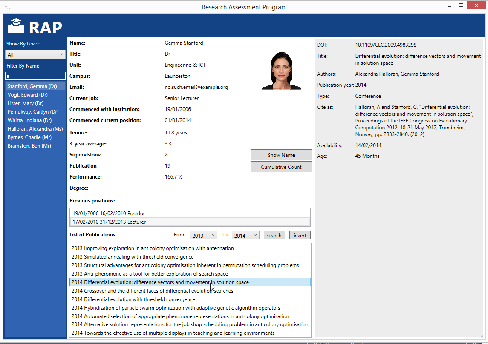
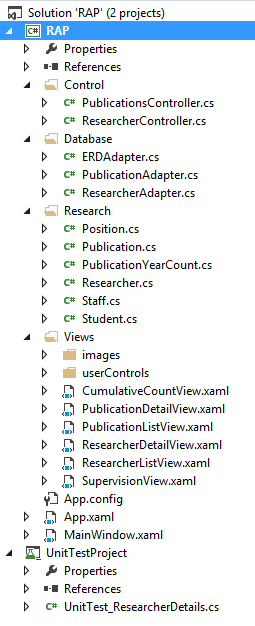
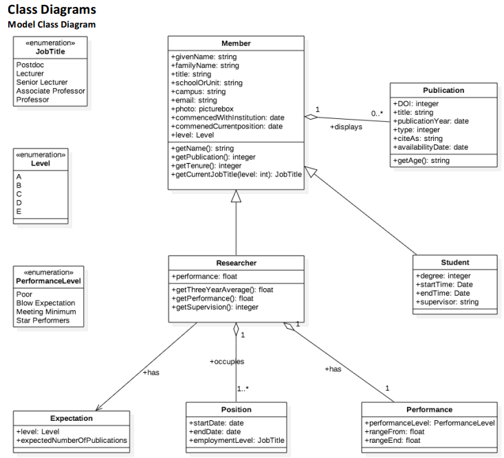
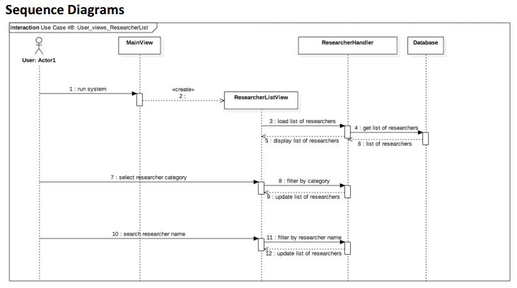

# RAP project
It is an assignment I did in my Master class. This project can be an example of using data binding, LINQ and database retrieving.

## main windows

## classes structure

## model class Diagram

## a example of sequential diagram

