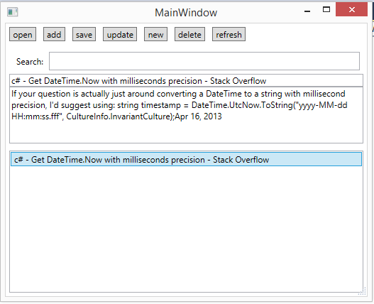

# json pure text records database

It is a simple project to read json files. It records a title and content of unit as a cell.
- Open: can open a new folder to store a json file
- Save：save the list into json file
- Add: add new unit into list
- Delete: remove a unit from list
- New: clear place for enther new unit
- Update: update current content or title of unit
- refresh： refresh the list from the json file 
